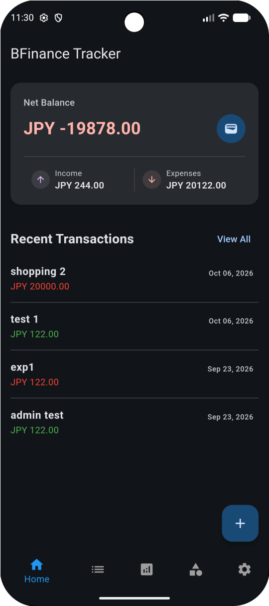
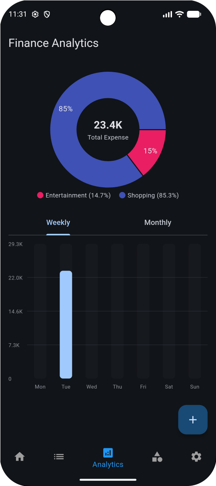
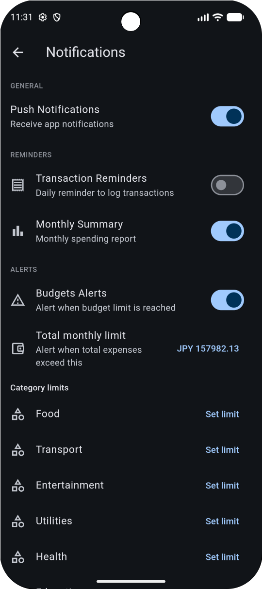
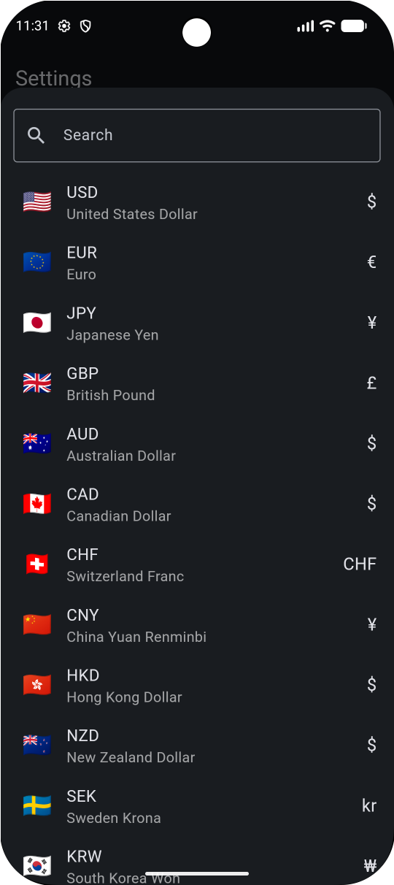

# BFinance

BFinance is a personal finance and expense-tracking mobile application built with **Flutter** and **Django REST Framework**.

The application helps users manage their income and expenses, organize transactions by category, manage budgets, and analyze their financial activity.

## Features

- User registration and login
- JWT-based authentication
- Expense and income management
- Custom and default categories
- Budget management
- Budget alerts and local notifications
- Spending analytics
- Currency selection and exchange-rate conversion
- Password reset via email OTP
- Persistent user authentication
- Secure token storage
- Error monitoring with Sentry

## Tech Stack

### Mobile

- Flutter
- Dart
- Provider
- Flutter Secure Storage
- SharedPreferences
- Local Notifications
- Currency Picker

### Backend

- Python
- Django
- Django REST Framework
- PostgreSQL
- JWT Authentication

### Other

- REST API
- Git / GitHub
- Sentry
- Docker

> Remove any technology above that is not actually used in this project.

## Architecture

The application uses a Flutter frontend communicating with a Django REST API backend.

```text
Flutter Mobile App
        |
        | REST API
        v
Django REST Framework
        |
        v
PostgreSQL
```

## Screenshots

<h3>Dashboard</h3>



<h3>Analytics</h3>



<h3>Budget</h3>



<h3>Change Currency</h3>



## Project Purpose

This project was developed to gain practical experience in mobile and backend application development, including API integration, authentication, database design, state management, and application deployment.

## What I Learned

Through this project, I gained practical experience with:

- Flutter application development
- REST API integration
- Authentication and authorization
- Database modeling
- State management with Provider
- Secure token management
- API error handling
- Local notifications
- Working with Git and GitHub
- Connecting a mobile application with a backend service

## Project Structure

```text
bfinance/
├── Flutter mobile application
└── Django REST API backend
```

## Status

The application is currently under development and testing.

## Author

**Your Name**

- GitHub: [Your GitHub Profile](YOUR_GITHUB_URL)
